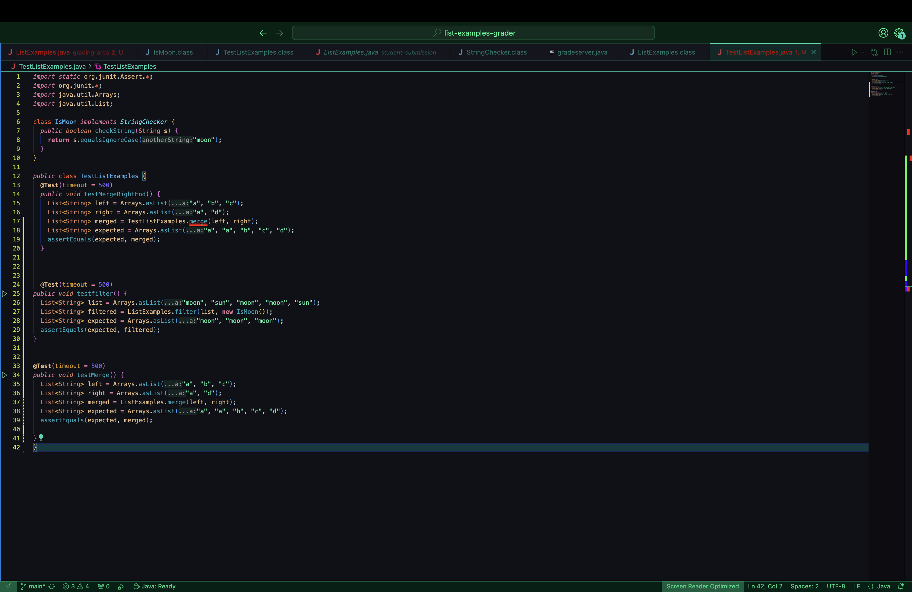
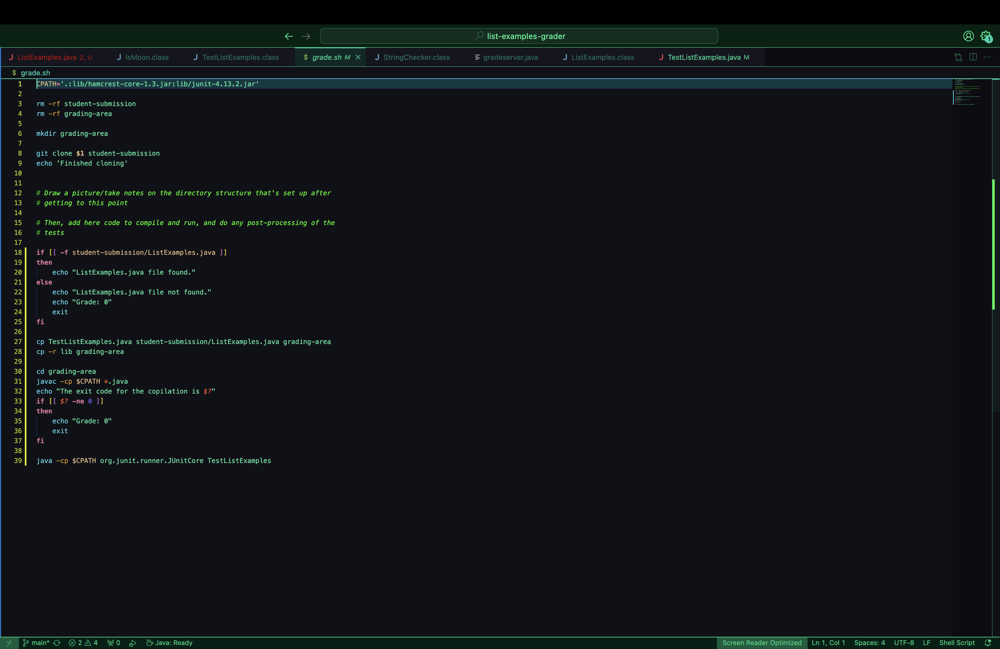

# Lab Report 5
## Part 1 – Debugging Scenario

## 1.Student Piazza Post 

The code and error jpg's attached in the Piazza post

## 2.Response from a TA 

## 3.  Terminal output showing what information the student got and clear description of the bug

I dentified the bug to be that the merge method was being called on the incorrect class. The bug inducing `TestListExamples` was  calling the merge method on `TestListExamples`. To fix this, I change line 17 to ` List<String> merged = ListExamples.merge(left, right);`. Here, the merge method is being called on `ListExamples`. 

## 4. Information needed about the setup
-The file & directory structure needed

-The contents of each file before fixing the bug

-The full command line (or lines) you ran to trigger the bug: `bash grade.sh https://github.com/ucsd-cse15l-f22/list-methods-corrected`
-A description of what to edit to fix the bug: I edited line 17 in the `TestListExamples`  file from week 6. The failure inducing code was `List<String> merged = ListExamples.merge(left, right);`. Which I then edited to be, `List<String> merged = ListExamples.merge(left, right);`

# Part 2 - Reflection 
Something cool I leared is that I can use `man` or `--help` in the command line to learn more about a specific command. I used this for vim and `grep` in the second half of the quarter. I think that this is a really quick and useful way of learning more about command. 
